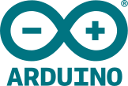

## ML Engineer / Low-Level Software Architect
I'm an AI & ML engineering student on the ML track with a parallel career as a low-level systems architect.  
I combine low-level software with deep engineering to build AI systems.

<h2 align="left">---My Website---</h2>
My Website: [yunhanref](www.yunhanref.com)

<h2 align="left" id="macropower-tech">Technologies</h2>
> Tools, languages, and other things that I like to work with.
<table>
  <tr>
    <td align="center" width="96">
      
       PyTorch
    </td>
    <td align="center" width="96">
      
       Pandas
    </td>
    <td align="center" width="96">
      
       TensorFlow
    </td>
    <td align="center" width="96">
      
       Rust
    </td>
    <td align="center" width="96">
      
       C++
    </td>
    <td align="center" width="96">
      
       Linux
    </td>
    <td align="center" width="96">
      
       Assembly
    </td>
    <td align="center" width="96">
      
       Arduino
    </td>
    <td align="center" width="96">
      
       Luau
    </td>       
  </tr>
</table>

* Open-source activity and repository highlights:

<table border="0">
  <tr>
    <td width="50%" valign="top">
      
    </td>
    <td width="50%" valign="top">
      
    </td>
  </tr>
</table>

---

  <i>My Socials</i>

                  
